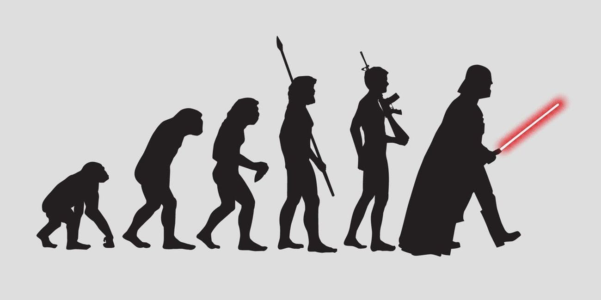
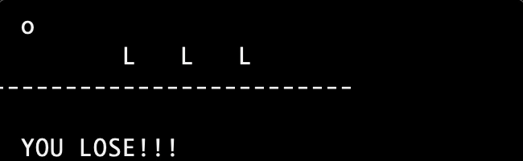
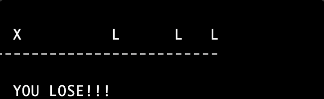
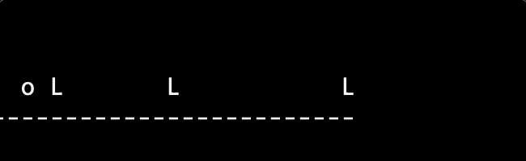
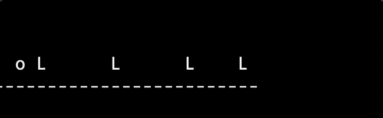

# Machine Learning Project 1 



## 内容介绍

本次Project大家只需要关注一个文件 `codes/hurdling_AI.py`。这个文件里完成的是用遗传算法来训练小球跨栏。作业内容具体来说内容有：

1. 参考上课内容与上课ppt，理解`hurdling_AI.py`中已有的代码，并写上合适的注释。
2. 修改并补全完成 `hurdling_AI.py`中的一个函数 `evolutionary_train()`，如果作业第一点完成的好的话，大概可以用5行代码完成这个函数。
   ```python
    # 你需要修改并补全这个函数
    # 把最终最好的dna和其对应的fitness返回
    def evolutionary_train():
        best_dna = [0]*SIZE
        best_fitness = 0        
        return (best_dna, best_fitness)
    ```
3. 机器学习逃不过去的调参。`hurdling_AI.py`中标注好了你需要调整的4个参数，并找到最好的参数组合。不同参数会导致不同的结果。
   ```python
   POPULATION_SIZE = 0    # 你需要自己尝试不同的设置来选择最好的参数
   GENERATION_NUM = 0   # 你需要自己尝试不同的设置来选择最好的参数
   MUTATION_RATE = 0.0  # 你需要自己尝试不同的设置来选择最好的参数
   MUTATION_RATIO = 0.0    # 你需要自己尝试不同的设置来选择最好的参数
   ```
4. 开放性思考题（选做）：遗传算法并不能保证有好的结果，那么大概在哪些情况下，它会有比较好的结果？

## Project 信息
* 提交方式：将你修改过的`hurdling_AI.py`源代码，以及你找到的那个最好的的dna（默认存为当前目录下名为`dna_file`的文件）压缩。把压缩包名字改为你的名字，发送到你们的私人slack频道。
* 评分方式：1: 你写的注释（代表你是否读懂了这些代码）2. 你的dna跑的有多远

## 注意事项与提示
* 请不要修改`codes/hurdling.py`中的内容
* 本例中fitness具有随机性，所以会出现有时跑的远有时跑的近的情况
* 可以在训练的循环中，每过几代就把当前最好的fitness打印出来，这样可以清楚地看到你的种群有没有在进化。
* 建议使用`codes/hurdling_AI.py`中已经定义好的各种函数来帮你，除非你有更好的方法。

## 操作指南

* 若要训练，可以在terminal中先通过`cd`移动到代码所在目录，然后`python3 hurdling_AI.py`来训练。当然如果你没完成`evolutionary_train()`函数的补全的话，训练是不会有用的。
* 若要看到一个dna文件的具体跨栏情况，可以在terminal中先通过`cd`移动到代码所在目录，然后`python3 hurdling.py dna_file`来查看此dna的情况。若你的dna文件不是这个名字，就用你的dna名字来代替`dna_file`。比如我们提供一个按照参考答案（未公布）训练了100代的dna，可以输入`python3 hurdling.py dna_file_gen100`来查看情况。把terminal窗口缩小到只能显示一行会效果更好哦。比如我自己写的版本的几个代数的情况：
  
    第1代：     
    
    
    
    第100代：
    
    
    
    第1000代：
    
    
    
    第10000代：
    
    