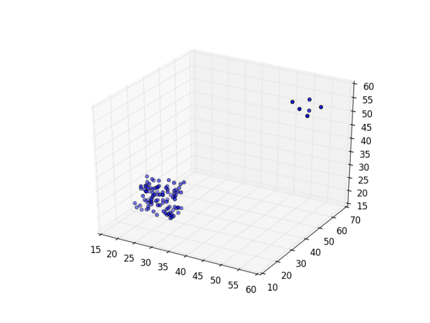
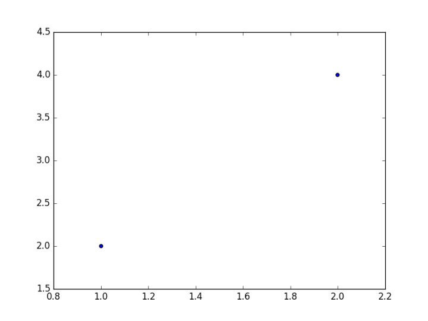

#数据可视化入门

Matplotlib是Python最著名的数据可视化工具包，有了它，一些统计上常用的图形如折线图、散点图、直方图等都可以用简单的几行Python代码实现。

而Pyplot是Matplotlib里用的最多的工具，他有2个最常用的场景，一个是画点，一个是画线。

## 画点
如果你有一堆的数据样本，想要找出其中的异常值，那么最直观的方法，就是将他们画成散点图，比如



可以很直观地看出右上角的6个点是明显的异常值。

那么用pyplot怎么画点呢？

看以下简单的代码

```python
#导入pyplot包，并简写为plt
import matplotlib.pyplot as plt

#定义2个点的x集合和y集合
x=[1,2]
y=[2,4]

#画散点图
plt.scatter(x,y)

#展示绘画框
plt.show()
```

运行一下会弹出这幅散点图，可以看到画出了两个坐标轴分别为[1,2]，[2,4]的点




然后我们可以利用参数做一些小的调整，比如

```
#调整点的颜色为红色，调整点的形状为x，调整点的大小为30
plt.scatter(x,y,color='red',marker='x',markersize='30')
```

或者可以调整一下坐标轴，加上这句

```python
#[]里的4个参数分别表示X轴起始点，X轴结束点，Y轴起始点，Y轴结束点
plt.axis([0,10,0,10])
```

## 画线

